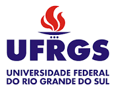

# StructDyn
Repositório de códigos utilizados por mim nas disciplinas da área de dinâmica estrutural na UFSM e UFRGS.
Atualmente (2024) é aplicado na disciplina ENG030224, Análise de Sistemas Mecânicos (DEMEC/UFRGS).

Contém códigos diversos para simulação de dinâmica estrutural, especialmente em vários 
graus de liberdade e considerando modelagem no espaço de estados.

Estão disponíveis códigos em Matlab e Python.

# Octave

O Octave é a versão aberta do Matlab. Pode ser encontrado em https://octave.org/.

# Python

